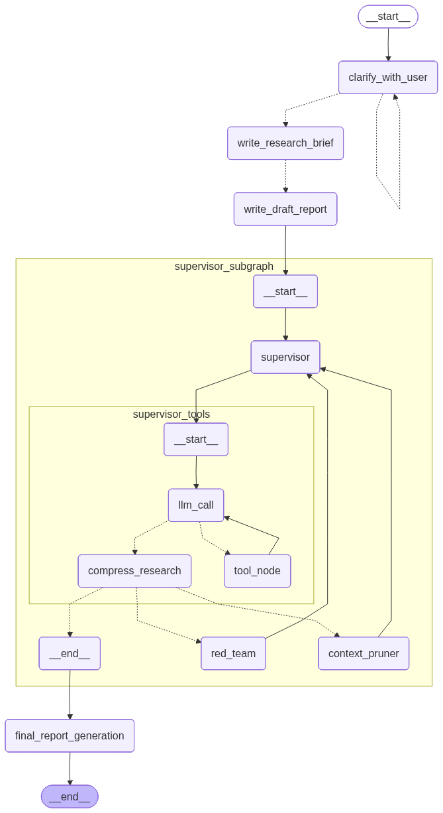

# DeepResearchAgent

A multi-agent research system built with LangGraph that takes a question, researches it deeply across multiple sources, critiques its own findings, and produces a structured report. Main runtime is a simple Gradio UI.

---

## Overview

The idea is simple: instead of a single LLM call, research gets broken into a pipeline where specialized agents handle different parts of the job — one plans, one searches, one critiques, one writes. The result is significantly more thorough than a plain ChatGPT query.

Built for personal use. Not a SaaS product.

**Stack:** Python 3.12 · LangGraph · OpenAI GPT-4o / GPT-5 · Tavily · Gradio · python-telegram-bot · uv

---

## Features

- **Clarification before research** — if the query is ambiguous, the system asks follow-up questions before starting (interrupt/resume via Gradio and Telegram)
- **Parallel web search** — multiple Tavily queries run concurrently across the research iteration
- **Adversarial critique (Red Team)** — a separate model challenges the draft and surfaces gaps, contradictions, or missing angles
- **Quality evaluation** — a judge model scores the draft and decides whether another research iteration is needed
- **Context compression** — raw research notes get compressed into a structured knowledge base to stay within context limits
- **Automatic session management** — each completed research session auto-rotates to a fresh thread
- **Request timeout** — requests cap at a configurable time limit; runtime returns timeout feedback instead of hanging
- **API retry** — Tavily and OpenAI calls retry automatically with exponential backoff on transient failures
- **Structured logging** — all agent activity logged to stdout (optionally to file via `LOG_FILE`)
- **Health endpoint** — `GET /health` on port 8080 for Telegram runtime monitoring

---

## Architecture



### Nodes and agents

**Main graph**

| Node | What it does |
|------|-------------|
| `clarify_with_user` | Decides if the query needs clarification. If yes, pauses and sends a question to caller runtime. Resumes when the user replies. |
| `write_research_brief` | Reformulates the (now-clarified) query into a structured research brief with scope, key questions, and constraints. |
| `write_draft_report` | Generates a first-pass skeleton report using the research brief. This draft drives what the supervisor chooses to research. |
| `supervisor_subgraph` | Orchestrates the research loop — delegates to researchers, evaluates quality, decides when to stop. |
| `final_report_generation` | Takes the final knowledge base and draft, writes the polished full report. |

**Supervisor subgraph**

| Node | What it does |
|------|-------------|
| `supervisor` | The planning brain. Given the current draft and knowledge base, decides what to research next and which tool to call. |
| `supervisor_tools` | Executes the supervisor's tool calls. Runs `ConductResearch` sub-agents in parallel, or calls `refine_draft_report` / `think_tool`. |
| `red_team` | Independently reviews the draft and pokes holes — checks for unsupported claims, missing perspectives, logical gaps. Findings feed back to the supervisor. |
| `context_pruner` | When raw research notes get long, this node extracts structured facts into a compressed knowledge base, keeping the context manageable. |

**Researcher subgraph** (runs inside `supervisor_tools` per research task)

| Node | What it does |
|------|-------------|
| `llm_call` | ReAct-style reasoning loop — plans the next action given current research findings. |
| `tool_node` | Executes tool calls: `tavily_search` for web search, `think_tool` for intermediate reasoning. |
| `compress_research` | When the researcher's notes hit a length threshold, compresses them before returning results to the supervisor. |

---

## Setup

**Prerequisites:** Python 3.12+, [uv](https://docs.astral.sh/uv/)

### 1. Clone and install

```bash
git clone https://github.com/thangthewinner/DeepResearchAgent
cd DeepResearchAgent
uv sync --dev
```

### 2. Configure environment

```bash
cp .env.example .env
```

Edit `.env` — fill in at least the two required keys:

| Variable | Where to get it |
|----------|-----------------|
| `OPENAI_API_KEY` | https://platform.openai.com/api-keys |
| `TAVILY_API_KEY` | https://app.tavily.com (free tier available) |

### 3. Run

**Gradio UI** (primary runtime):

```bash
uv run python examples/gradio_app.py
```

Then open `http://localhost:7860`.

**Optional runtimes:**

```bash
# Telegram bot (requires TELEGRAM_BOT_TOKEN in .env)
uv run python examples/telegram_bot.py

# CLI smoke test
uv run python examples/simple_query.py
```

**Docker Compose** (Gradio only):

```bash
docker compose up --build
```

### Configuration reference

All environment variables with their defaults. See `.env.example` for the full list with comments.

**Required:**

| Variable | Description |
|----------|-------------|
| `OPENAI_API_KEY` | OpenAI API key |
| `TAVILY_API_KEY` | Tavily search API key |

**Runtime:**

| Variable | Default | Description |
|----------|---------|-------------|
| `TELEGRAM_BOT_TOKEN` | _(empty)_ | Telegram bot token (only for Telegram runtime) |
| `REQUEST_TIMEOUT_SECONDS` | `600` | Max seconds per research request |
| `RESEARCHER_TIMEOUT_SECONDS` | `120` | Max seconds per researcher sub-agent |
| `MAX_CONCURRENT_RESEARCHERS` | `1` | Max parallel researcher sub-agents |
| `MAX_RESEARCHER_ITERATIONS` | `5` | Max supervisor loop iterations |

**Model overrides:**

| Variable | Default |
|----------|---------|
| `BASE_MODEL` | `openai:gpt-4o` |
| `CREATIVE_MODEL` | `openai:gpt-4o` |
| `WRITER_MODEL` | `openai:gpt-5` |
| `COMPRESS_MODEL` | `openai:gpt-4o` |
| `COMPRESSOR_MODEL` | `openai:gpt-4o-mini` |
| `SUMMARIZATION_MODEL` | `openai:gpt-4o-mini` |
| `CRITIC_MODEL` | `openai:gpt-4o` |
| `JUDGE_MODEL` | `openai:gpt-4o` |

**Observability:**

| Variable | Description |
|----------|-------------|
| `LOG_LEVEL` | `DEBUG` / `INFO` / `WARNING` / `ERROR` (default: `INFO`) |
| `LOG_FILE` | Path to rotating log file, e.g. `logs/app.log` |
| `LANGCHAIN_TRACING_V2` | Set `true` for LangSmith tracing |
| `LANGCHAIN_API_KEY` | LangSmith API key |
| `LANGCHAIN_PROJECT` | LangSmith project name |

